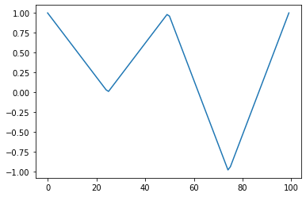
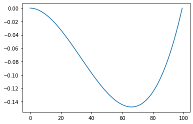
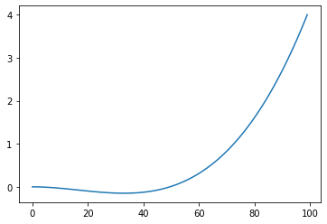
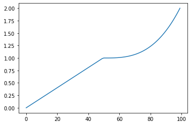
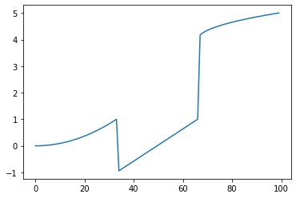

# signal_composer

Library for composing signals from arrays and functions.

## Usage

### Creating Signals

#### From interpolated arrays

```python
signal = Signal([1, 0, 1, -1, 1])
```



#### From functions

```python
f = lambda x: x ** 3 - x ** 2
signal = Signal(f)
```



```python
f = lambda x: x ** 3 - x ** 2
signal = Signal(f, function_input_span=[0, 1 + 0.25])
```


### Composing Signals
#### From adding signals

```python
signal_1 = Signal([0, 1])
signal_2 = Signal(lambda x: 1 + x ** 3)
composed_signal = signal_1 + signal_2
```



#### From lists

```python
signals = [
    lambda x: x ** 2,
    [-1, 0, 1],
    lambda x: 4 + x ** (1/2)
]

composed_signal = Signal.compose_from_list(signals)
```



## How to install

### Option 1: Manually

Clone the GitHub repo and install manually by passing

```
gh repo clone danlessa/signal_composer
cd signal_composer
pip install -e .
```

### Option 2: PyPi

Just pass:
`pip install signal_composer`
